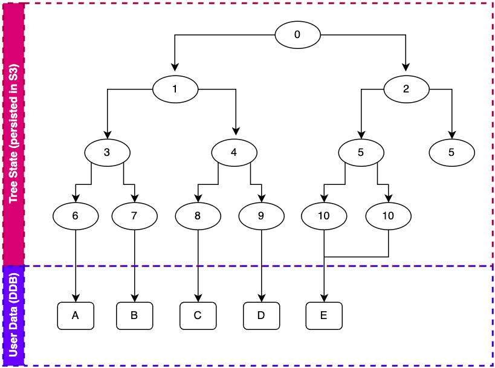
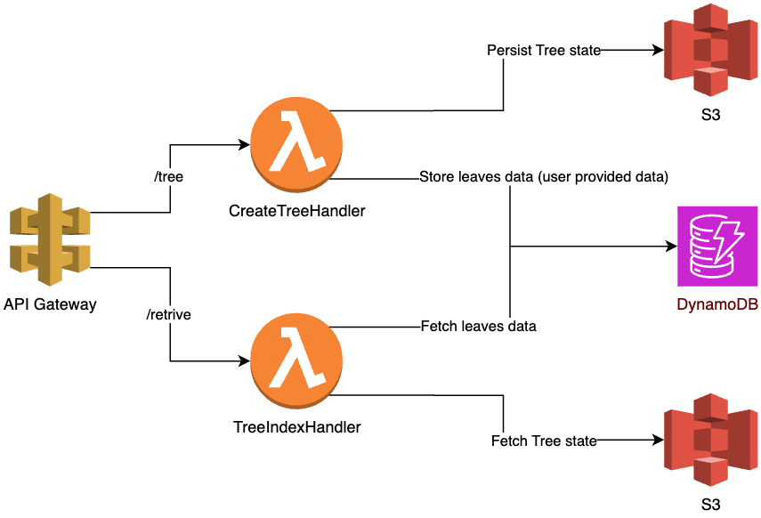

## MerkleTreeApp

This is a RESTFul service implemented in Python with two endpoints:

- `/tree`: Create a Merkle Tree with a list of data
- `/retrieve`: Given a Merkle Tree id and an index of a node in the tree,
  returns information of the node.

The service is deployed in AWS Cloud using its Cloud Development Toolkit.

## MerkleTree Model

The service implements binary MerkleTree, where a node can have maximum of two children.
The implementation also enforces a full tree, where each node has either no node or two nodes,
to simplify tree serialization and deserialization. This requires the tree to have even nodes
in every level. So, whenever a level happens to have an odd number of nodes (during creation),
it duplicates the last node in the level to make the list even.

Each leaf node contains the hash of the data it points to. Every intermediate node contains a hash
of a concatenation of its children hash.

```python
import hashlib

node.hash = hashlib.sha256(data)  # Leaf nodes

node.hash = hashlib.sha256(node.left.hash + node.right.hash)  # Intermediate node
```

The implementation uses SHA-256 hash.

The hash of the root node is used as the tree id.

An example of Merkle Tree created with data `["A", "B", "C", "D", "E"]` is shown below.
As you can see, node `10` is copied to make even nodes in the leaf level, both pointing to the
same data. Similarly, node `5` is copied to make even nodes on the level above the leaf.



## Persistence

The tree data is persisted in two stores. User provided data (data pointed by leaf nodes) are
persisted in DynamoDB. DynamoDB is an easy to use key-value store and scales well for very large number
operations and data volume. So, it fits well in this case we do not know the limit of data items
we might receive. User data are stored with individual item's hash as a primary key.

Tree state (nodes) are stored in S3. The tree currently do not support updates, so S3 works well for
storing the tree snapshot (persisted during tree creation.) My *choice* of storage for the tree state
was Document database, like MongoDB. But the integration in AWS required some effort, so I decided
to store it in S3. In Document DB, we can model each node as a Document with its children referencing
to corresponding Document. So, this model allows fetching the full/partial tree in a single operation.

Besides, this also simplifies when we want to support updates. When persisting a tree snapshot as a
single blob, any update to tree basically invalidates the blob. So we need to recreate the blob
and persist again. However, modeling each node as a document allows us to only update the nodes that
were affected by the update.

Document DB does have scaling concern compared to key-value stores, like DynamoDB. For example, we
can model tree in key-value store where each node is stored independently with (root_id + node_id) as a
primary key. This allows us to fetch all/particular node of the tree. However, the number of operations
become very large for big trees, for example, if a tree has 10k nodes, then we need 10k operations
just to load the tree. A strategy to reduce number of operation is to save each tree level as an item
in key-value store. However, this won't work for large tress in DynamoDB due to item size limitation.

## Architecture

A simple schematic of service architecture is shown below.



The service endpoints are deployed in APIGateway with business logic in AWS Lambda Function.
As mentioned above, S3 and DynamoDB are used for the persistence.

## API Call Examples

### `/tree`

Request Body

```javascript
// If data is not provided, the API uses demo data ["7", "8", "9", "10", "11", "12", "13", "14"]
{
    "data": ["A","B","C","D","E"]
}
```

Response Body

```json
{
  "tree_id": "2db1790243fe117685d21ed0ff5005d9832e5f32bf5b2b02cddf0f07a34421b2"
}
```

### `/retrieve`

Request Body
```javascript
// if tree_id is not provided, it uses 
// a demo tree id "bf57020a599b6ca72c29faca759d2f5c782b0fd1b611ed529e0ea422c28daf36"
// that is created using demo data ["7", "8", "9", "10", "11", "12", "13", "14"]
{
    "tree_id": "2db1790243fe117685d21ed0ff5005d9832e5f32bf5b2b02cddf0f07a34421b2",
    "index": 5
}
```

Response Body
```json
{
  "depth": 2,
  "offset": 2,
  "value": "4441435e9da65331ce2eccf7aca694c30acbb8289111964f9948db710915d819"
}
```

## Future Improvements

1. **Atomic Tree creation:** Currently, the app does not guarantee atomic persistence of user data as well as tree
   state. So,
   need support atomic tree creation, that guarantees persistence of user data as well as tree state upon
   successful tree creation.
2. **Error Handling:** Need to throw specific errors and handle some leaking exceptions from the libraries. Add
   retry support for some failure cases. Catch user input errors and return proper error codes.
3. **Improve Testing:** Improve testing. Test with AWS services failure and retry.
4. **Better build scripts:** Add check-style, bug inspection, code coverage, etc.
    